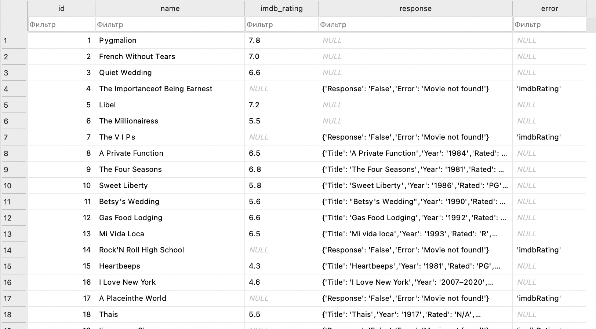

Simple example of usage http://www.omdbapi.com

Must provide api_key as first argument to script `python3 app.py {YOR_API_KEY}`

Omdbapi have limit of 1000 request per day, for 1$ patreon you get 100,000 per day.

Provide movie list as txt file with names line by line.

Unique names will be added to sqlite movie table and for each with imdb_rating is null will be request done. Rating updated on success or error field will be populated, original response saved too.

After all requests complete - resulting txt file will be generated. (you can comment request part to force generate results)

Notice: omdbapi name parsing not so clever and you mast provide movie names without errors.